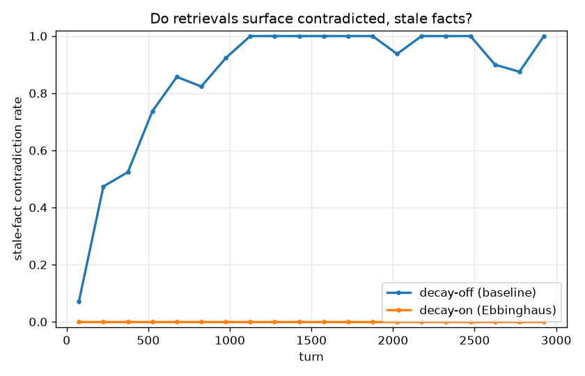
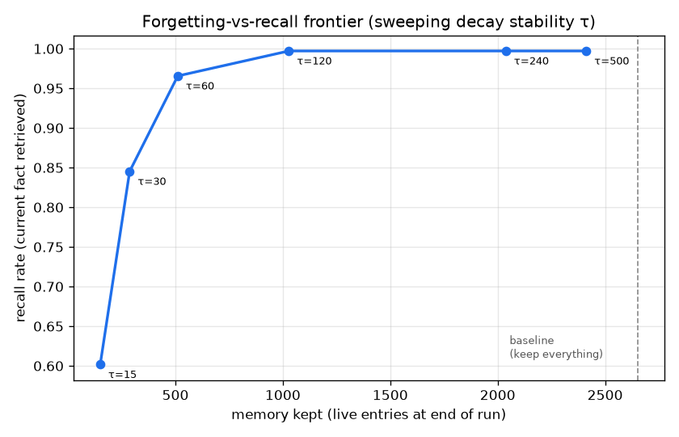

# Forgetting-Bench

*A benchmark for whether agent memory **forgets** — not just whether it recalls.*

Every mainstream agent-memory library (mem0, Letta/MemGPT, Zep) is built and benchmarked around **recall**: can it fetch the right fact back. Almost none measure the other half of long-horizon memory — whether an agent **forgets stale facts, resolves contradictions, and stays bounded** over thousands of turns. That gap is where agents rot: the context window fills with outdated, contradictory memories and token cost grows without limit.

Forgetting-Bench measures that axis, and ships a small reference memory core whose decay module demonstrably beats a keep-everything baseline on it.

## The finding

On a seeded 3,000-turn workload of facts, updates, contradictions and distractor noise (349 queries, top-5 retrieval), turning on the Ebbinghaus decay module — versus the incumbent "keep everything" baseline — gives:

| Metric | decay-off (baseline) | decay-on | |
|---|---|---|---|
| **Stale-fact contradiction rate** | **0.860** | **0.000** | ↓ contradictions eliminated |
| Stale fraction of retrieved context | 0.474 | 0.000 | ↓ context no longer polluted |
| Recall (current fact retrieved) | 0.997 | 0.997 | = no recall cost |
| Answer accuracy (top-1 correct) | 0.980 | 0.983 | = held |
| Final memory size (live entries) | 2,651 | 1,259 | ↓ 53% smaller |
| Final token count | 19,251 | 9,444 | ↓ 51% cheaper |

The baseline answers the *current* question fine (recall 0.997) but drags a contradicted, stale fact into the retrieved context **86% of the time** — and its memory grows without bound. Decay removes every contradiction and roughly halves memory, at **no cost to recall**.



Forgetting is not free everywhere: push decay harder (smaller stability `τ`) and you eventually forget live facts too. The benchmark makes that tradeoff explicit — there's a wide plateau where you keep full recall while shedding most of memory:



<!-- TODO screenshot: terminal running `make bench` -->

Every number above is produced by running the code — see [Reproduce it](#reproduce-the-finding). Nothing here is hand-entered.

## Why this is hard to measure (and why the workload is synthetic)

To score a *contradiction* you must know the ground truth — what the current value of a fact actually is at turn *N*, and which retrieved memories are stale. Real chat logs don't come labeled. So Forgetting-Bench generates a **deterministic, seeded** stream where every update, contradiction and distractor is known, giving exact ground truth at every turn. No API keys, no model downloads, no paid calls — the whole thing runs offline and reproducibly.

## Install

```bash
git clone https://github.com/veersaraf/forgetting-bench
cd forgetting-bench
pip install -e ".[dev]"     # core is pure-stdlib; matplotlib only for plots
```

## Quickstart — the memory core in 20 lines

```python
from forgetting_bench.memory import MemoryStore, EbbinghausDecay

mem = MemoryStore(decay=EbbinghausDecay(tau=150))
mem.add("Alice's home city is boston.",     turn=0,  entity="alice", attribute="home_city")
mem.add("Alice's home city is now denver.", turn=50, entity="alice", attribute="home_city")

top = mem.retrieve("What is Alice's home city?", now=60, k=2)
for s in top:
    print(f"{s.score:.2f}  strength={s.strength:.2f}  {s.entry.text}")
```

```
0.79  strength=1.00  Alice's home city is now denver.
0.04  strength=0.05  Alice's home city is boston.        <- contradicted, suppressed
```

The stale "boston" fact is still in the stream but its ranking strength is crushed by supersession, so it won't pollute the agent's context. Swap `EbbinghausDecay` for `NoDecay` and it comes right back to the top.

## Reproduce the finding

```bash
make bench      # == python -m forgetting_bench.experiment
```

Runs the A/B (decay off vs on) plus the `τ` sweep over one seeded workload, prints the results table, and writes `results/summary.{json,md}` and three plots (`bloat.png`, `contradiction.png`, `tradeoff.png`). Deterministic: same seed, same numbers, every run.

```bash
make test       # 36 tests over scoring, decay, supersession, metrics, workload,
                # and a regression guard on the finding itself (across seeds)
```

## How it works

```
forgetting_bench/
├── memory/           the reference core
│   ├── store.py        generative-agents retrieval: recency + importance + relevance
│   ├── decay.py        pluggable forgetting: Ebbinghaus decay, consolidation, supersession, pruning
│   ├── embedder.py     dependency-free sparse hashing embedder (the "relevance" term)
│   ├── importance.py   heuristic importance scorer (LLM-swappable)
│   └── entry.py        the memory stream's atomic entry
├── workload/         seeded synthetic long-horizon stream with ground truth
├── bench/            harness + the forgetting-axis metrics
├── adapters/         run any memory system through the same harness
└── experiment.py     the headline A/B + plots
```

**Retrieval** scores each memory by the generative-agents trio — recency, importance, relevance — as a weighted sum in `[0, 1]`, then multiplies by a **ranking strength** from the decay module.

**The decay module** is the differentiator and is fully pluggable (`DecayModule` ABC). `EbbinghausDecay` provides:
- **Time decay & consolidation** — retention follows `R(t) = exp(-t / S)`, where stability `S = τ · (1 + gain · importance)`, so important memories are forgotten more slowly.
- **Contradiction supersession** — a newer fact about the same `(entity, attribute)` slot flags older ones as superseded, collapsing their ranking strength so stale facts drop out of retrieval.
- **Pruning** — once retention falls below a threshold the entry is dropped, keeping memory bounded. Contradicted facts and low-importance noise cross the threshold first.

`NoDecay` — retain everything at full strength — is the incumbent baseline and the other arm of the A/B.

**Relevance** uses a deterministic, dependency-free sparse hashing embedder by default so the demo needs no API key or model download. `Embedder` and `ImportanceScorer` are clean interfaces: swap in real sentence embeddings or an LLM importance rater without touching the store.

## Comparing against real libraries (mem0 / Letta / Zep)

The `MemoryAdapter` interface (`adapters/base.py`) is the seam: any memory system that can ingest an observation and answer a query with ranked memories can be scored by the same harness. `adapters/reference.py` wraps this repo's core; `adapters/mem0_stub.py` is a **documented, clearly-labeled stub** showing exactly where a real mem0 integration plugs in (including the metadata round-trip needed to score contradictions).

**Status:** the MVP takes no hard dependency on those packages — the seam and docs are in place, but wiring a live backend is the honest next step, not a shipped feature.

## Status / what's next

- ✅ Reference memory core, seeded workload with ground truth, four forgetting-axis metrics, one-command reproducible A/B with plots, 36 tests.
- 🔜 **Live incumbent adapters** — run mem0 / Letta / Zep through the harness for a head-to-head (interface + stub exist today; the backends are not wired).
- 🔜 **Real embeddings / LLM importance** behind the existing interfaces, to check the finding survives semantic (not just lexical) relevance.
- 🔜 **Richer contradiction types** — numeric drift, partial updates, and entity/attribute extraction from free text (today the workload supplies structured slot keys; production would extract them).

### Honest limitations

- The workload is **synthetic and lexical**: relevance is bag-of-words overlap, and supersession relies on structured `(entity, attribute)` keys the workload provides. This isolates the forgetting mechanism cleanly, but the finding should be re-validated with real embeddings and extracted keys (see next steps) before claiming it transfers to production traffic.
- Contradiction detection here is exact-slot; fuzzy or numeric contradictions are future work.

## License

MIT — see [LICENSE](LICENSE).
