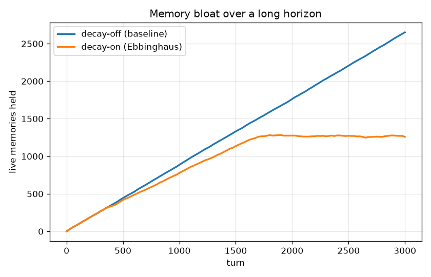
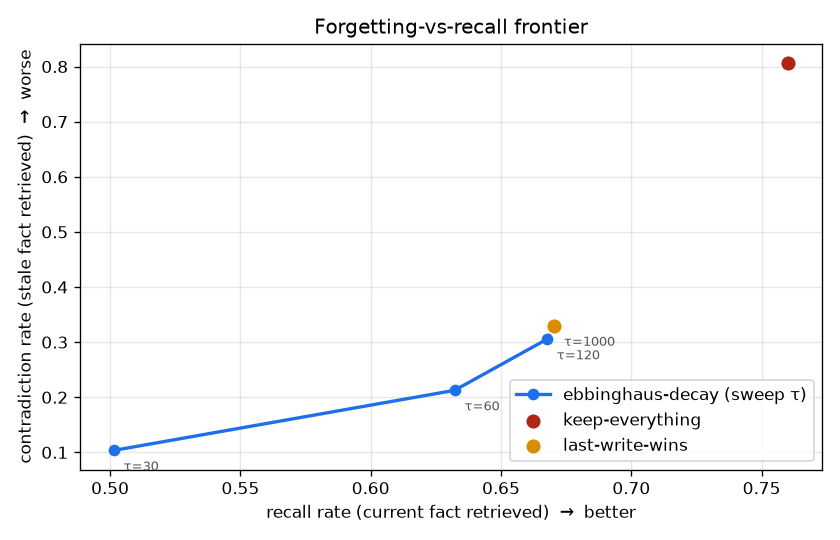

# Forgetting-Bench

*A benchmark for whether agent memory **forgets** — not just whether it recalls.*

Mainstream agent-memory libraries (mem0, Letta/MemGPT, Zep) are built and benchmarked around **recall**: can it fetch the right fact back. The under-measured half of long-horizon memory is whether an agent **forgets stale facts, resolves contradictions, and stays bounded** over thousands of turns — because that is where agents rot: the retrieved context fills with outdated, contradictory memories and token cost grows without limit.

Forgetting-Bench measures that axis on a reproducible long-horizon workload, and ships a small reference memory core with a pluggable decay module so you can see where forgetting helps, where it costs you, and where no memory policy can win.

## The setup (why the numbers aren't gamed)

A contradiction is only measurable if you know the ground truth. So the workload is **seeded and synthetic**: 3,000 turns of facts, value updates (contradictions), and distractor noise, with the correct current value of every slot known at every turn.

The catch that makes this honest: the memory core does **not** receive clean slot keys. It **extracts** `(entity, attribute)` from raw text with a small **PyTorch slot tagger** — and **40% of updates are phrased to defeat it** (paraphrases and implicit/numeric updates like *"Alice relocated to Denver"* or *"Bob got a raise to 110k"*, which never restate the attribute). The tagger is trained to imitate a keyword teacher on canonical phrasing and to abstain on those hard updates, so the miss is learned rather than a regex — but it is still a miss. When extraction misses, the update isn't linked to its slot, so contradiction suppression **cannot fire** and the stale fact survives. The metric, by contrast, is scored against ground truth the memory never sees. That gap is deliberate — it's what stops the contradiction metric from being a tautology, and it gives every method a real error floor.

## The finding

Three memory policies over the same workload (seed 0, 3,000 turns, 367 queries, top-5 retrieval):

| Metric (n=367 queries) | keep-everything | last-write-wins | ebbinghaus-decay | want |
|---|---|---|---|---|
| **Stale-fact contradiction rate** | 0.807 | 0.330 | **0.319** | lower |
| Stale fraction of retrieved context | 0.359 | 0.066 | **0.064** | lower |
| Recall (current fact retrieved) | 0.760 | 0.670 | 0.668 | higher |
| Answer accuracy (top-1 correct) | 0.657 | 0.657 | 0.654 | higher |
| Precision (correct fact / retrieved) | 0.190 | 0.134 | 0.134 | higher |
| **Final memory size** (entries) | 2,633 | 2,325 | **1,361** | lower |
| **Final token count** | 18,859 | 17,121 | **9,903** | lower |

Read this honestly — there are three distinct findings, not one flashy one:

1. **No policy drives contradictions to zero.** Slot extraction misses ~40% of the updates, so there is a real contradiction *floor* (~0.33) that both dedup and decay hit. A benchmark where the number went to 0.000 would be measuring its own plumbing, not memory quality.

2. **Decay's genuine win over the mem0-style bar is bounded memory, not contradiction.** `last-write-wins` (per-slot dedup — what mem0-style fact memory already does) matches decay on contradictions and recall. But it never forgets what it can't slot, so **distractor noise accumulates forever**. Ebbinghaus decay matches its contradiction handling (0.319 vs 0.330) and recall (0.668 vs 0.670) while holding **~40% less memory / ~42% fewer tokens** — and the gap widens with horizon:

   

3. **Forgetting is a tunable frontier, not a free lunch.** Sweeping decay stability `τ` trades recall for fewer contradictions: `τ=30` cuts contradictions to 0.10 but drops recall to 0.50; `τ=1000` keeps recall at 0.67 but lets contradictions climb back to the 0.33 floor. `last-write-wins` is a *single fixed point* on this frontier; decay lets you move along it — at a fraction of the memory.

   

Every number here is produced by `make bench` — see [Reproduce it](#reproduce-the-finding). `make bench` also runs a fourth reference arm, **learned-forget** (a trained PyTorch prune/rank policy). That column is written to `results/summary.{json,md}` from the harness; it is not copied into this table unless those files say so.

**On the one adverse number:** keep-everything "wins" precision (0.190 vs 0.134) and recall (0.760). That is hoarding, not skill — retaining every past value means old entries whose value coincidentally equals the current one get counted as correct hits. The same hoarding is why it has by far the *worst* contradiction rate. Reported here rather than dropped.

## Scope of the claim

The table above is the reference core: three (plus learned-forget) policies over the same extractor and the same seeded workload. Live mem0 / Letta adapters exist and call those SDKs ([below](#comparing-against-real-libraries)). They are **not runnable** in the default install — no `MEM0_API_KEY` / `LETTA_API_KEY` — and `make bench` does not invent a score for them. No claim here is a mem0 or Letta win.

## Install

```bash
git clone https://github.com/veersaraf/forgetting-bench
cd forgetting-bench
pip install -e ".[dev]"     # torch (CPU is enough) + matplotlib + pytest
# optional live incumbents — still need API keys to actually run:
# pip install -e ".[incumbents]"
```

## Quickstart — the mechanism, and its blind spot

```python
from forgetting_bench.memory import MemoryStore, EbbinghausDecay
from forgetting_bench.workload import default_extractor

mem = MemoryStore(decay=EbbinghausDecay(tau=150), slot_extractor=default_extractor())
mem.add("Alice's home city is boston.", turn=0)
mem.add("Alice's home city is now denver.", turn=50)   # canonical: extractor links it

for s in mem.retrieve("What is Alice's home city?", now=60, k=2):
    print(f"{s.score:.2f}  strength={s.strength:.2f}  {s.entry.text}")
```

```
0.79  strength=1.00  Alice's home city is now denver.
0.04  strength=0.05  Alice's home city is boston.        <- contradicted, suppressed
```

Now phrase the update as a paraphrase the slot extractor can't link:

```python
mem.add("Alice relocated to denver.", turn=50)   # extractor misses -> no supersession
```

```
0.79  strength=1.00  Alice's home city is boston.        <- stale fact survives, ranks #1
0.49  strength=1.00  Alice relocated to denver.
```

That miss is not a bug to hide — it is exactly the failure mode Forgetting-Bench quantifies.

## Reproduce the finding

```bash
make bench      # == python -m forgetting_bench.experiment
make bench-live # same, plus live mem0 / Letta if SDKs + credentials exist
```

Runs the reference arms (keep-everything, last-write-wins, ebbinghaus-decay, learned-forget) plus the `τ` sweep over one seeded workload, prints the table, and writes `results/summary.{json,md}` and three plots (`bloat.png`, `contradiction.png`, `frontier.png`). Deterministic: same seed, same numbers. Live incumbents are probed every run; they are only *scored* when `--incumbents` is set **and** the backend actually opens.

```bash
make test       # scoring, decay, supersession, learned extraction, learned
                # forget, adapter probes, workload ground truth, finding guards
```

## How it works

```
forgetting_bench/
├── memory/           the reference core
│   ├── store.py        generative-agents retrieval: recency + importance + relevance
│   ├── decay.py        pluggable policy: NoDecay, LastWriteWins, EbbinghausDecay
│   ├── learned_decay.py  trained PyTorch forget policy (rank + prune)
│   ├── extractor.py    keyword teacher (canonical phrases only)
│   ├── learned_extractor.py  PyTorch slot tagger on the write path
│   ├── embedder.py     dependency-free sparse hashing embedder (the "relevance" term)
│   ├── importance.py   heuristic importance scorer (LLM-swappable)
│   └── entry.py        the memory stream's atomic entry
├── workload/         seeded synthetic long-horizon stream with ground truth
├── bench/            harness + the forgetting-axis metrics
├── adapters/         reference + live mem0 / Letta (real SDKs, or unavailable)
└── experiment.py     the reference arms + optional live incumbents + plots
```

**Retrieval** scores each memory by the generative-agents trio — recency, importance, relevance — as a weighted sum in `[0, 1]`, then multiplies by a **ranking strength** from the decay module.

**The decay module** (`DecayModule` ABC) is the pluggable axis. Four ship:
- `NoDecay` — keep everything at full strength (the hoarding baseline).
- `LastWriteWins` — a newer fact about the same *extracted* slot evicts the older one; no time decay, so noise is never forgotten.
- `EbbinghausDecay` — retention `R(t) = exp(-t / S)` with importance-weighted stability `S = τ·(1 + gain·importance)` (important memories consolidate); **contradiction supersession** collapses a superseded fact's ranking strength; and **retention-threshold pruning** drops decayed entries so memory stays bounded. Ranking-strength (supersession) is kept separate from the time-decay curve (pruning) on purpose: multiplying the score by time-decay too would let a fresh irrelevant memory outrank an old but still-correct one.
- `LearnedForget` — a tiny MLP trained offline on synthetic (age, importance, superseded, slotted) features. It still supersedes only on extracted slots; what it learns is when to down-rank and when to drop. It does not see metric ground truth.

**A note on the workload's phrasing.** Canonical updates are phrased in the same frame as the query (*"Alice's home city is now denver"* vs *"What is Alice's home city?"*), so stale and current versions of a slot are lexically near-identical and retrieval leans on recency + supersession to separate them — isolating the forgetting mechanism from a phrasing confound. The *hard* updates deliberately break that frame; that is the whole source of the contradiction floor.

## Comparing against real libraries (mem0 / Letta / Zep)

The `MemoryAdapter` interface (`adapters/base.py`) is the seam: any system that ingests an observation and answers a query with ranked memories can be scored by the same harness. `adapters/reference.py` wraps this repo's core.

`adapters/mem0.py` and `adapters/letta.py` call the **live SDKs** (`mem0.Memory` / `MemoryClient`, Letta archival `passages`). They store benchmark `(entity, attribute, value)` only as sidecar / metadata for scoring — the backend retrieves on text. They are optional (`pip install -e ".[incumbents]"`) and require credentials:

| Backend | Runnable when | `make bench` default |
|---|---|---|
| mem0 | `mem0ai` installed and `MEM0_API_KEY` or `OPENAI_API_KEY` set | **not runnable** — probed, not scored |
| Letta | `letta-client` installed and `LETTA_API_KEY` or `LETTA_BASE_URL` set | **not runnable** — probed, not scored |
| Zep | still unwired | — |

`make bench-live` (`--incumbents`) constructs those adapters only when the probe says they can open. If they cannot, the run prints the reason and writes no mem0 / Letta metrics. There is no re-implementation fallback score.

## Status / what's next

- ✅ Reference core with four memory policies (including a learned forget MLP), a trained PyTorch slot extractor that still misses the hard-update 40%, seeded workload with ground truth, forgetting-axis metrics, one-command reproducible experiment with plots.
- ✅ **Live incumbent adapters** — real mem0 / Letta SDK wiring, metadata/tag round-trip, honest probes. **Not yet runnable** without credentials; no incumbent numbers are claimed.
- 🔜 **Zep adapter** and a credentialed live run that can be published as numbers.
- 🔜 **Semantic embeddings** behind the existing embedder interface — better retrieval would raise recall on paraphrases for every arm equally; the interesting question is whether decay's memory-bounding win survives.

### Honest limitations

- **Lexical, not semantic.** Relevance is bag-of-words overlap, so paraphrased current facts are hard to retrieve for *every* arm — which is why recall tops out around 0.67 here. That caps all arms equally (a fair comparison), but the absolute recall numbers would rise with real embeddings.
- **One extractor, false-negatives only.** The learned tagger is trained to imitate a keyword teacher, so it models missed contradictions, not *false* supersession (wrongly merging two different slots), which would let forgetting hurt recall in a second way. That's a known gap, not modeled.
- **Synthetic workload.** The finding should be re-validated on real multi-session traffic before claiming it transfers; the value here is a clean, reproducible testbed and a decay module with a measured, honest tradeoff — not a production benchmark result.

## License

MIT — see [LICENSE](LICENSE).
